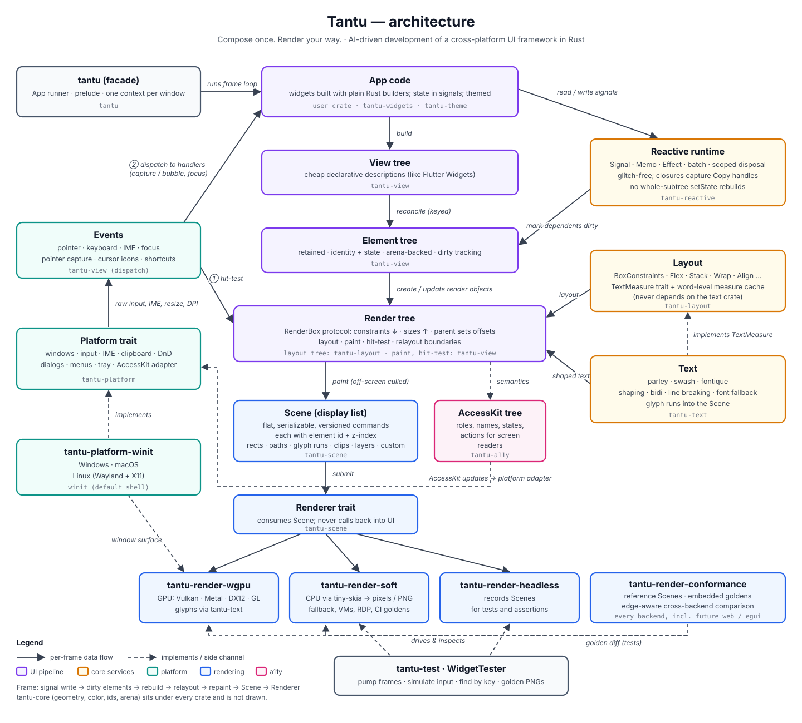

# Tantu architecture

_Last updated: 2026-09-30. This is a living document. Update it, and the diagram, in the same
change as any design decision that affects it (see the rule in `AGENTS.md` → General rules)._

This document explains how the pieces of Tantu fit together. `AGENTS.md` holds the rules
(crate boundaries, conventions), `PLAN.md` holds the roadmap and `docs/adr/` holds the reasoning
behind individual decisions. If this document disagrees with any of them, treat it as a bug: fix
whichever one is wrong in the same change.



- Diagram source: [`architecture/tantu-architecture.svg`](architecture/tantu-architecture.svg)
  (edit this one)
- Rendered copy: [`architecture/tantu-architecture.png`](architecture/tantu-architecture.png)
- Original hand sketch: [`architecture/rough-sketch.png`](architecture/rough-sketch.png)

To regenerate the PNG after editing the SVG:

```bash
inkscape "$PWD/docs/architecture/tantu-architecture.svg" \
  -o "$PWD/docs/architecture/tantu-architecture.png" -w 2880
```

## Goals that shape the design

1. **Renderer independence.** UI, layout and widget code never touch a graphics API. They produce a
   data-only `Scene`, and any backend (GPU, CPU, headless, later web) can draw it.
2. **Flutter-like authoring.** Apps compose widgets in plain Rust. Layout follows Flutter's
   protocol: constraints go down, sizes come up, the parent positions its children.
3. **Scale to enterprise UIs.** A retained tree with fine-grained reactivity means that a change
   touches only what depends on it, which is what makes 50k-row grids and docking layouts workable.

## The pipeline

| Stage | Crate | What it is |
|---|---|---|
| App code | user crate, `tantu-widgets`, `tantu-theme` | Functions returning `impl View`, built with builders; state kept in signals |
| View tree | `tantu-view` | Cheap, short-lived descriptions of the UI, like Flutter `Widget`s |
| Element tree | `tantu-view` | Retained nodes in an arena. Each has a stable identity, holds state, and tracks whether it is dirty |
| Render tree | `tantu-view` + `tantu-layout` | `RenderBox`-style objects that do layout, paint and hit-testing |
| Scene | `tantu-scene` | Flat, serializable, versioned list of draw commands. Each command carries an element id and z-index |
| Renderer | `tantu-scene` (trait), `tantu-render-*` | Draws a Scene. Never calls back into the UI |

**Build.** App code produces a View tree. Views are values, so building them is cheap.

**Reconcile.** The reconciler matches new views against existing elements, by key where one is
given and by position otherwise. Matched elements keep their identity, so focus, IME state,
scroll position, animations and accessibility nodes survive a rebuild.

**Layout.** Render objects run Flutter's protocol: a parent passes `BoxConstraints` down, the child
returns a `Size`, and the parent sets the child's offset. Relayout boundaries stop a change from
spreading up the tree. Intrinsic-size queries are opt-in. Layout widgets (`Row`, `Column`,
`Expanded`, `Padding`, `Stack`, …) and custom layouts use the same protocol.

**Paint.** Render objects emit Scene commands and skip anything off-screen (culling).

**Render.** A `Renderer` implementation consumes the Scene:

- `tantu-render-wgpu` is the default GPU backend (Vulkan, Metal, DX12, GL).
- `tantu-render-soft` renders on the CPU with tiny-skia. It is the fallback for VMs, RDP/Citrix and
  old GPUs, and it produces the golden PNGs in CI.
- `tantu-render-headless` records Scenes so tests can assert on them.

## Reactivity

`tantu-reactive` provides `Signal`, `Memo`, `Effect`, batching and scoped disposal. Widgets read
signals inside closures. When a signal changes, only the elements that read it are marked dirty.
There is no whole-subtree `setState`. One frame looks like this:

```
signal write → dependent elements marked dirty → rebuild those views → reconcile
  → relayout (bounded by relayout boundaries) → repaint → Scene → Renderer
```

Closures capture `Copy` signal handles and elements live in an arena addressed by id, which avoids
`Rc` cycles between the tree and the reactive graph.

## Layout and text

`tantu-layout` holds the constraint types and the layout algorithms (Flex, Stack, Wrap, Align, …).
It measures text only through the `TextMeasure` trait, with a word-level measure cache, so it does
not depend on the text crate.

`tantu-text` (parley, swash, fontique) handles shaping, bidi, line breaking and font fallback. It
implements `TextMeasure`, hands shaped paragraphs to text render objects, and those emit glyph runs
into the Scene. Backends rasterize the glyphs.

## Events and input

1. The platform shell delivers raw input (pointer, keyboard, IME, resize, DPI changes) through
   the `Platform` trait.
2. Pointer events are hit-tested against the **render tree**, which knows where everything is.
3. The event is dispatched along the path of the hit element with capture and bubble phases.
   Keyboard events follow focus. Handlers are app closures, and they usually write to signals.
4. Those signal writes start the next frame (see Reactivity).

Pointer capture, cursor icons, shortcuts and the command registry live in `tantu-view`'s dispatch
layer.

> The rough sketch drew events flowing into the View tree. In the actual design, events are
> hit-tested against the render tree and dispatched to handlers. The View tree only changes because
> a handler wrote to a signal.

## Accessibility

`tantu-a11y` builds an AccessKit tree from the semantics that render objects expose (role, name,
state, actions). Node ids come from element ids, so the tree can be updated incrementally. The
platform layer owns the AccessKit adapter that talks to Narrator, VoiceOver and Orca, and passes
screen-reader actions back as events.

## Platform

`tantu-platform` defines the `Platform` trait: windows, input, IME, clipboard, drag and drop,
dialogs, menus, tray and the AccessKit adapter. `tantu-platform-winit` is the default
implementation and covers Windows, macOS and Linux (Wayland and X11). The platform provides the
window surface that the GPU backend draws into. Nothing outside `tantu-platform-*` depends on winit.

## Facade and testing

- `tantu` is the facade crate: the `App` runner that owns the frame loop (one context per
  window, no hidden global state) and the `prelude`.
- `tantu-test` provides `WidgetTester`: pump frames, simulate input, find by key or semantics,
  compare against golden PNGs. It uses the headless and software renderers, so tests do not need a
  GPU.

## Crate dependencies

`tantu-core` (geometry, color, ids, arena, errors) sits under every crate and is left out of the
diagram. The allowed dependencies are listed in the `AGENTS.md` workspace table. The hard rules:

- Nothing below `tantu-view` knows about widgets.
- Only `tantu-render-*` may depend on `wgpu` or `tiny-skia`.
- Only `tantu-platform-*` may depend on `winit`.

## Design decisions reflected here

| Decision | Where recorded |
|---|---|
| Retained tree + fine-grained signals | [ADR-0001](adr/0001-retained-tree-and-fine-grained-reactivity.md) |
| Flutter structure and layout protocol | [ADR-0002](adr/0002-flutter-structure-and-layout-protocol.md) |
| Scene as the renderer contract | [ADR-0003](adr/0003-scene-as-the-renderer-contract.md) |
| Platform trait, winit by default | [ADR-0004](adr/0004-platform-trait-with-winit-by-default.md) |
| Text stack: parley + swash + fontique | [ADR-0005](adr/0005-text-stack-parley-swash-fontique.md) |
| wgpu as default GPU backend | [ADR-0006](adr/0006-wgpu-as-the-default-gpu-backend.md) |
| Clay techniques used internally only (measure cache, ids on commands, culling, anchored overlays) | `PLAN.md`, `HANDOFF.md` |

The full list, with statuses, is in [`adr/README.md`](adr/README.md).

## Keeping this document current

Any change that alters the architecture must update this file and the diagram in the same change.
That includes a new or removed crate, a changed dependency edge, a change to the pipeline stages,
a new backend or platform shell, or a new or superseded ADR. Edit the SVG, regenerate the PNG and
bump the _Last updated_ date. Reviewers should reject architecture changes that leave this
document stale.
